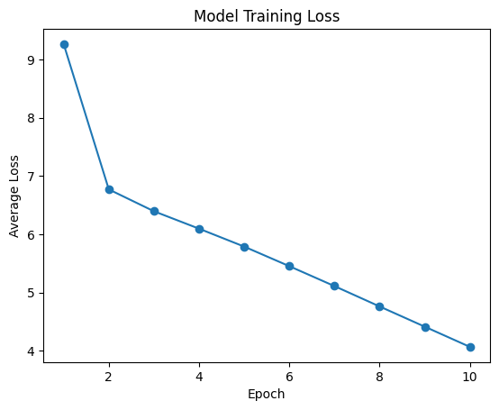
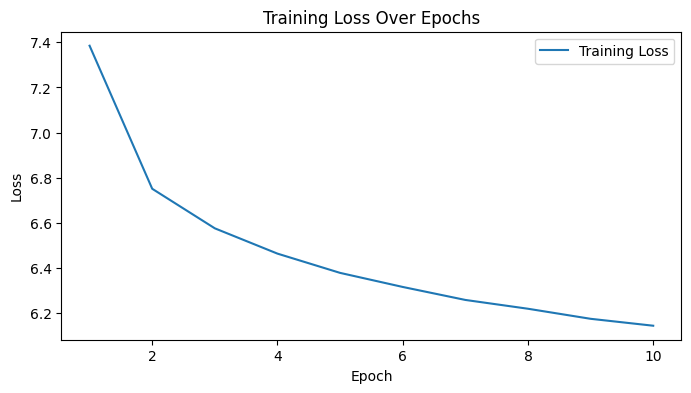

# Persian Language Model

## Project Overview
The goal of this project is to develop and evaluate deep learning models for Persian language understanding and generation. The dataset includes the Persian Wikipedia text corpus and a collection of Persian stop words. Two models are implemented: an RNN-based language model and a Transformer-based language model, with a comparative analysis of their performance.

## Mathematical Background
Standard NLP evaluation metrics are used:

- **Cross-Entropy Loss** measures the difference between predicted token probability distributions and actual next tokens. It is defined as:

```math
\text{CrossEntropyLoss} = -\frac{1}{N} \sum_{i=1}^{N} \sum_{j=1}^{V} y_{i,j} \log(\hat{y}_{i,j})
```

where \(N\) is the number of samples, \(V\) is the vocabulary size, $y_{i,j}$ is the true probability of token \(j\) for sample \(i\), and $\hat{y}_{i,j}$ is the predicted probability.

- **Perplexity**, calculated as the exponential of the average cross-entropy loss, represents how "surprised" the model is by test data. It is given by:

```math
\text{Perplexity} = \exp\left(\frac{1}{N} \sum_{i=1}^{N} \sum_{j=1}^{V} y_{i,j} \log(\hat{y}_{i,j})\right)
```

These metrics provide insights into the model's performance in predicting the next token in a sequence.

## Model Architecture

### RNN Model
- **Embedding Layer**: 64-dimensional embeddings.
- **Recurrent Layer**: Standard RNN with 128 hidden units.
- **Output Layer**: Linear layer for token prediction.
- **Context Window**: Predicts the next token based on a context window of 5 tokens.

### Transformer Model
- **Token Embeddings**: 256-dimensional embeddings.
- **Positional Encodings**: Learnable positional encodings.
- **Encoder**: 6-layer Transformer encoder.
    - **Attention Heads**: 8 attention heads per layer.
- **Output Layer**: Linear layer for token prediction.
- **Sequence Length**: Fixed at 512 tokens.

## Training Process

### Preprocessing
The preprocessing steps included the following:

1. **Noise Removal**: Cleaned the text by removing irrelevant characters while retaining Persian-specific punctuation. Whitespace was normalized to ensure consistency.
2. **Tokenization**: Applied Byte-Pair Encoding (BPE) with a vocabulary size of 30,000 tokens. Special tokens such as `<unk>`, `<pad>`, `<s>`, and `</s>` were included to handle unknown tokens, padding, and sequence boundaries.

### Training Configuration
The training configurations for the RNN and Transformer models are summarized in the table below:

| Parameter               | RNN Model               | Transformer Model       |
|-------------------------|-------------------------|-------------------------|
| **Learning Rate**       | 0.001                   | 0.0001                 |
| **Batch Size**          | 64                      | 8                      |
| **Epochs**              | 10                      | 10                     |
| **Embedding Size**      | 64                      | 256                    |
| **Hidden Size**         | 128                     | N/A                    |
| **Attention Heads**     | N/A                     | 8                      |
| **Encoder Layers**      | N/A                     | 6                      |
| **Sequence Length**     | 5 (context window)      | 512                    |
| **Optimizer**           | Adam                   | Adam                   |
| **Loss Function**       | CrossEntropyLoss        | CrossEntropyLoss       |

### Evaluation
The evaluation process involved:

1. **Loss Monitoring**: Training loss was tracked across epochs to assess model convergence.
2. **Perplexity Calculation**: Perplexity was computed on validation sets to measure the model's ability to predict the next token.
3. **Qualitative Assessment**: Generated text samples were reviewed to evaluate the quality and diversity of the outputs.


## Results

### Performance Metrics
The RNN model achieved an initial training loss of ~9.26 and a final loss of ~4.07, with a validation perplexity of 2.07. The Transformer model started with a training loss of ~7.4 and ended at ~6.2, with a validation perplexity of 444.68.

### Loss Curves
Below are the loss curves for both models, showing the progression of training and validation loss over epochs:

- **RNN Model Loss Curve**:
    

- **Transformer Model Loss Curve**:
    

### Analysis
The RNN model achieved lower perplexity but generated repetitive text, while the Transformer model produced more diverse text despite higher perplexity. Performance limitations were due to limited computational resources, small datasets, and constrained hyperparameter tuning.

## References
- Datasets: [Persian Wikipedia Dataset](https://www.kaggle.com/datasets/miladfa7/persian-wikipedia-dataset), [Persian Stop Words](https://www.kaggle.com/datasets/alioraji/persian-stop-words)
- Libraries: [PyTorch](https://pytorch.org/), [Tokenizers](https://huggingface.co/docs/tokenizers/)
- Methodologies: [Byte-Pair Encoding](https://arxiv.org/abs/1508.07909), [Transformer](https://arxiv.org/abs/1706.03762)
